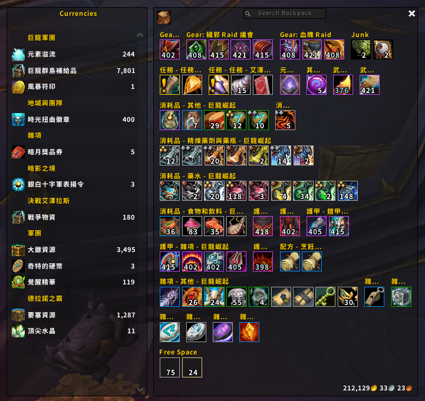

# 🪄 BetterBags ElvUI Skin

This is a customizable ElvUI skin for [BetterBags](https://www.curseforge.com/wow/addons/better-bags).

Retail ✅ WotLK ✅ Classic Era ✅

  

## ⭐ Features

1. Well-tunned ElvUI Skin for BetterBags.
2. Rapid initialization through lazy loading.
3. Comprehensive support for ElvUI Plugins, including:
   - WindTools
   - ToxiUI
   - MerathilisUI
   - BenikUI
4. Enable ElvUI Cooldowns in BetterBags.

## ❓ FAQ

> Why I cannot set Masque style for the buttons in BetterBags?

The addon uses ElvUI's skin feature to manage all the buttons in BetterBags. If Masque is also used for skinning, some unexpected style errors may occur.

## 📸 Screenshots

## ⚙️ Options

Adjust the skin settings within ElvUI Options `/ec`.

## 📜 License

GPLv3
